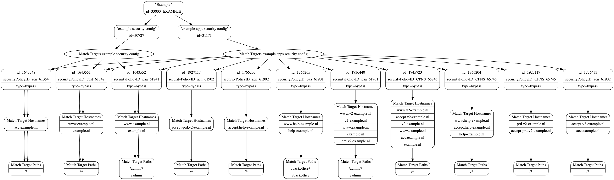

# harvestGraph

CLI tools which used to visualize Akamai Network list usage.

__Under heavy development__
Please forgive us for some error or issue.

## Dependencies

* [Akamai Network List CLI](https://github.com/apiheat/akamai-cli-netlist) - to get Network list data
* [Akamai AppSec CLI](https://github.com/akamai/cli-appsec) - to get Security configuration data
* [GraphViz](https://www.graphviz.org/download/) - to generate images from `.dot` graphs

## Akamai Permissions

* Read Akamai Security configuration
* List Akamai Security configurations
* Read Akamai Network list
* List Akamai Network lists

## Usage

### Setup edgerc credentials location

```shell
> export AKAMAI_EDGERC_SECTION="default"
> export AKAMAI_EDGERC_CONFIG="~/.edgerc"
```

### Get available Security Configurations in your account

```shell
> export SOURCE_DIR="/tmp"
> akamai appsec configs --json --edgerc ${AKAMAI_EDGERC_CONFIG} --section ${AKAMAI_EDGERC_SECTION} | jq '[.configurations[] | {configId: .id, configName: .name}]' > ${SOURCE_DIR}/configurations_map.json
```

### Export Security Configurations version data

```shell
for CONFIGURATION in $(akamai appsec --edgerc ${AKAMAI_EDGERC_CONFIG} --section ${AKAMAI_EDGERC_SECTION} configs)
do
  akamai appsec --json --edgerc ${AKAMAI_EDGERC_CONFIG} --section ${AKAMAI_EDGERC_SECTION} export --config ${CONFIGURATION} | jq . > ${SOURCE_DIR}/${CONFIGURATION}.json
done
```

### Harvest graph or metadata for given Network list or for all

To get one Network list usage graph

```shell
# Default output type is JSON. If destination flag is not set, result will be sent to STDOUT
> export OUTPUT="dot"
> export DESTINATION="~/myrepo/netlist-usage/"
> harvestgraph --id 12345_NETWORKLIST --name "Network List" -m ${SOURCE_DIR}/configurations_map.json -s ${SOURCE_DIR}/appsecConfigs -d ${DESTINATION} -o ${OUTPUT}
```

To get all Network lists usage graphs

```shell
for NETLIST_ID in $(akamai netlist --config ${AKAMAI_EDGERC_CONFIG} --section ${AKAMAI_EDGERC_SECTION} get all | jq '.[].uniqueId' | tr -d '"')
do
  NETLIST_NAME=$(akamai netlist --config ${AKAMAI_EDGERC_CONFIG} --section ${AKAMAI_EDGERC_SECTION} get by-id --id ${NETLIST_ID} | jq '.name' | tr -d '"')
  ./harvestgraph --id 12345_NETWORKLIST --name "Network List" -m ${SOURCE_DIR}/configurations_map.json -s ${SOURCE_DIR}/appsecConfigs -d ${DESTINATION} -o ${OUTPUT}
done
```

Bash script for actions below can be found in this repository: `run.sh`

### Create PNG images from graphs

```shell
> mkdir ${DESTINATION}/images
> ls -1 ${DESTINATION} | grep '.dot' | tr -d '.dot' | xargs -I % sh -c "dot -Tpng graphs/%.dot > ${DESTINATION}/images/%.png"
```

### Create simple markdown file with all images

```shell
> ls -1 ${DESTINATION}/images | tr -d '.png' | xargs -I % sh -c "echo -e $'List ID: __%__\n\n\\n' >> Network_Lists_Dependencies.md"
> sed -i 's/\\\!\[/![/g' Network_Lists_Dependencies.md
```

## Example result

Metadata json file can be found in `example/example.metadata` file.

Graph



## Help

```shell
> ./harvestgraph --help

NAME:
   harvestgraph - CLI tools which used to visualize Akamai Network list usage.

USAGE:
   harvestgraph [global options] command [command options] [arguments...]

VERSION:
   local

AUTHORS:
   Petr Artamonov
   Rafal Pieniazek

COMMANDS:
     help, h  Shows a list of commands or help for one command

GLOBAL OPTIONS:
   --destination value, -d value                                 Path for destination files. If empty results will be sent to STDOUT
   --id ID, -i ID                                                Network List ID
   --map-file configuration map file, -m configuration map file  Path for configuration map file
   --name NAME, -n NAME                                          Network List NAME
   --output value, -o value                                      Output result as .json metadata or as .dot graphviz files (default: "json")
   --source value, -s value                                      Path, where Security configuration JSON files are located (default: "os.TempDir()")
   --help, -h                                                    show help
   --version, -v                                                 print the version
```

## Development

In order to develop the tool with us do the following:

1. Fork repository
1. Clone it to your folder ( within *GO* path )
1. Ensure you can restore dependencies by running

   ```shell
   go get ./...
   ```

1. Make necessary changes
1. Make sure solution builds properly ( feel free to add tests )

   ```shell
   > go build -ldflags="-s -w -X main.appVer=1.2.3 -X main.appName=$(basename `pwd`)" -o $(basename `pwd`)
   ```
